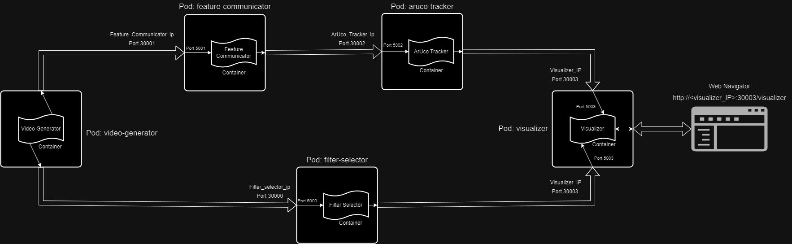

# Despliegue de la aplicación RA en Kubernetes

Para realizar el despliegue de la aplicación de realidad virtual en Kubernetes, vamos a usar una maquina con el S.O. Ubuntu 22.04, en el que instalaremos minikube como clúster simple de prueba y kubectl como interfaz de comandos de Kubernetes.

Hay que configurar la IP del nodo que nos proporciona normalmente el proveedor del clúster, pero minikube tiene la opción para darle una IP externa de uso local (consultar notas).



Esquema del despliegue en Kubernetes

## Instalación

1. Instalar minikube
    
    ```bash
    # actualizamos el sistema
    sudo apt-get update -y
    sudo apt-get upgrade -y
    # dependencias y drivers de virtualbox
    sudo apt-get install apt-transport-https wget curl
    sudo apt install virtualbox virtualbox-ext-pack # (sólo si queremos usar el driver de Virtualbox para las máquinas del cluster)
    # instalamos minikube
    url -LO https://storage.googleapis.com/minikube/releases/latest/minikube-linux-amd64
    sudo install minikube-linux-amd64 /usr/local/bin/minikube && rm minikube-linux-amd64
    # comprobamos si se ha instalado correctamente
    minikube version
    ```
    
2. Instalar kubectl
    
    ```bash
    # descargamos e instalamos
    curl -LO https://storage.googleapis.com/kubernetes-release/release/`curl -s https://storage.googleapis.com/kubernetes-release/release/stable.txt`/bin/linux/amd64/kubectl
    # damos permisos a kubectl
    chmod +x ./kubectl
    # lo movemos a la carpeta /local/bin/
    sudo mv ./kubectl /usr/local/bin/kubectl
    # comprobamos que se instaló correctamente
    kubectl version -o json
    ```
    

1. Iniciar minikube
    
    ```bash
    # arrancamos el cluster de minikube usando los drivers de docker 
    minikube start --driver=docker
    #Para usar siempre este driver
    minikube config set driver docker
    # comprobamos que tenemos acceso al cluster
    kubectl cluster-info
    kubectl config view
    ```
    

---

## Despliegue

Una vez tenemos minikube y kubectl instalados y arrancados, tenemos que crear los deployments. Para ello, usamos las siguientes instrucciones:

```bash
kubectl apply -f VideoGenerator.yaml
kubectl apply -f FilterSelector.yaml
kubectl apply -f FeatureCommunicator.yaml
kubectl apply -f ArUcoTracker.yaml
kubectl apply -f Visualizer.yaml
```

Esto, además de crear los deployments, también crea los servicios asociados a cada uno de ellos, permitiendo la comunicación entre los diferentes pods.

[YAMLs Kubernetes](YAMLs_Kubernetes.md)

---

## Comandos útiles de minikube

```bash
minikube ssh # acceso a la máquina virtual
minikube stop # parada del servidor
minicube delete # borrado de la máquina virtual
minikube addons list # addons disponibles
minikube dashboard # abre una página web con informacon del cluster
```

---

## Asignación de IPs

Para asignar IP externas a los deploys, se debe consultar la IP del clúster (nodo) donde están los pods. En caso de que sea con minikube, podemos ejecutar "kubectl get nodes", mirar el nodo donde están nuestros pods, y ejecutar "kubectl describe <nodo>". Ahí podemos buscar el valor dado al campo InternalIP.

Para exponer un servicio públicamente -> minikube service <nombre-del-servicio>

- Para ver el Visualizer en el navegador: [http://192.168.49.2:30003/visualizer](http://192.168.49.2:30003/visualizer) (la IP puede variar)
    
    

---

## Troubleshooting

- Si falla por un tema de red:
    
    ```bash
    docker swarm leave --force
    docker network prune
    ```
    
- Si falla por un tema de permisos:
    
    ```bash
    sudo usermod -aG docker $USER && newgrp docker
    ```
    
- Si falla por un tema de la máquina Virtual (VM), comprueba que tienes activadas en la BIOS las extensiones de virtualización.

Es posible que la instalación de minikube falle debido a que Docker desktop esté instalado en el sistema. Si ocurre, recomiendo deshacer toda la instalación de Docker Desktop y volver a instalar minikube.

---
